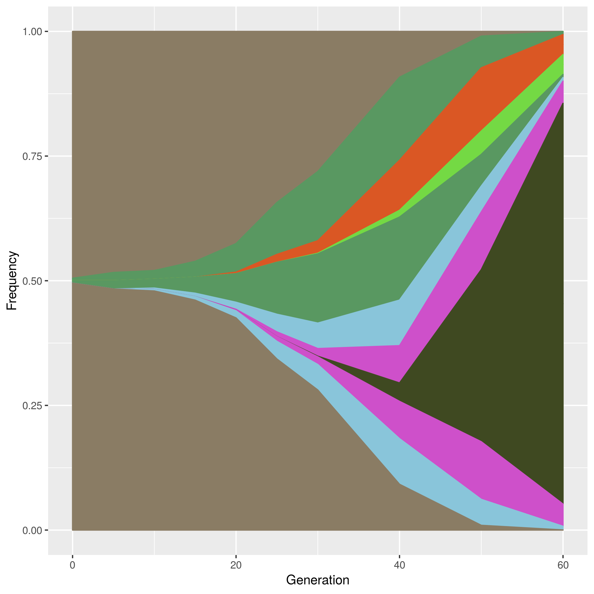

# A set of scripts to cluster mutations into genotypes and cluster genotypes by background.


# Sample Usage

```
python muller.py --input [input filename] --output [output folder]
```

The script generates eight files:
-  `input filename`.ggmuller_edges.csv

	Used as the `edges` input to ggmuller

- `input filename`.ggmuller_populations.csv

	Used as the `population` input to ggmuller

- `input filename`.genotypes.xlsx

	A table with the mean frequency of each genotype at each timepoint. The mean is calculated from the trajectories that comprise each genotype.

- `input filename`.trajectories.csv

	A table of the population trajectories used in the analysis. Each trajectory represents the frequency of a single mutation at each timepoint.

- `input filename`.mermaid

	A script written in the [mermaid](https://mermaidjs.github.io) scripting language. Generates a diagram indicating the hierarchy of genotypes/backgrounds in the current population.

- `input filename`.yaml

	Contains additional information for each genotype, as well as the parameters used for the analysis.

- `input filename`.r

	A basic r script to import the `population` and `edges` tables and generate a muller plot.
	
- `input filename`.png

	The muller plot generated by the r script.


# Script Options

	-h, --help                  Show this help message and exit
	-i, --input                 The table of trajectories to cluster.
	-o,  --output               The folder to save the files to.
	--fixed                     The minimum frequency at which to consider a mutation fixed.
	--detected                  The minimum frequency at which to consider a mutation detected.
	-s, --significant           [0.15] The frequency at which to consider a genotype 
	                            significantly greater than zero.
	--matlab                    Mimics the output of the original matlab script.
	-f, --frequencies           [0.10] The frequency cutoff to use when sorting genotypes. 
	                            May be a comma-separated string of frequencies, or a set inverval 
	                            to use when generating the frequency breakpoints. 
	                            For example, a value of 0.15 will use the frequencies 0,.15,.30,.45...
	-r --similarity-cutoff      [0.05] Maximum p-value difference to consider trajectories related. 
	                            Used when grouping trajectories into genotypes.
	-l, --difference-cutoff     [0.10] Used to unlink unrelated trajectories present in a genotype.

# Example Usage
```
python --input [filename] --output [folder] --matlab
```
Trajectories will be grouped into genotypes and each genotype will be nested using the same parameters the original matlab script used. The original script used different values in each script when performing frequency detection/significance. The improved version of the script (without the --matlab flag) harmonized these parameters so that similar calculations use the same parameter rather than re-defining the value to use.
```
python --input [filename] --frequencies 0.05 --detected 0.10
```
Groups genotypes in groups of 0.05 (i.e. [0.00, 0.05, 0.10, ... , 0.90, 0.95, 1.00]) based on each genotype's maximum frequency. Each genotype in each group is then sorted by the timepoint it was first detected (the first timepoint where the frequency was greater than 0.10). Output files are saved to the same folder as the input table.

# Diagram

The `.mermaid` file can be used to generate a quick diagram showing the relation between all genotypes in the population.


