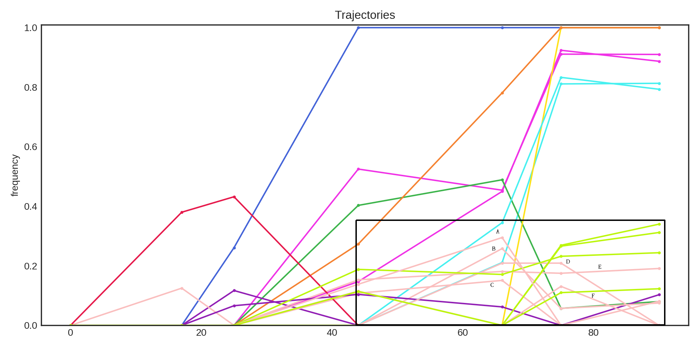
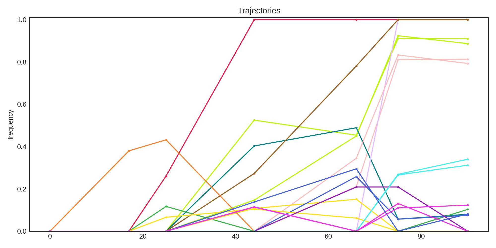
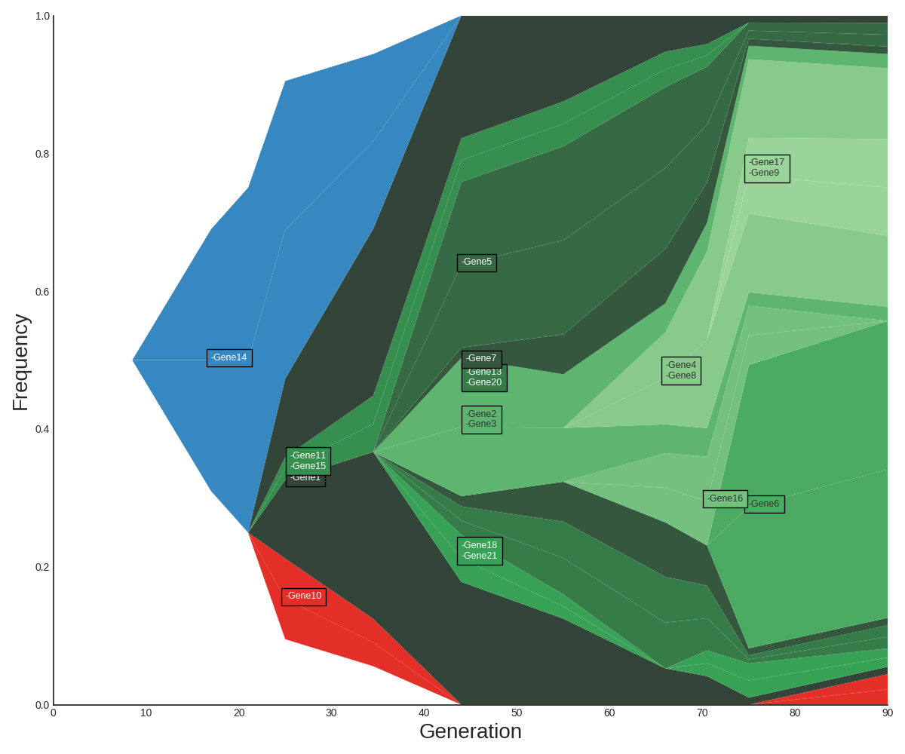
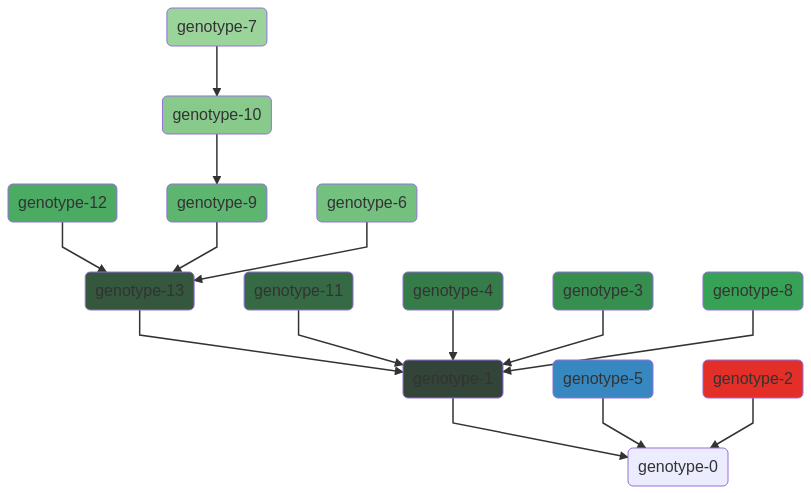
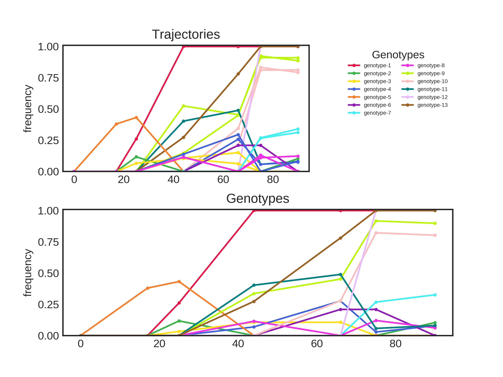
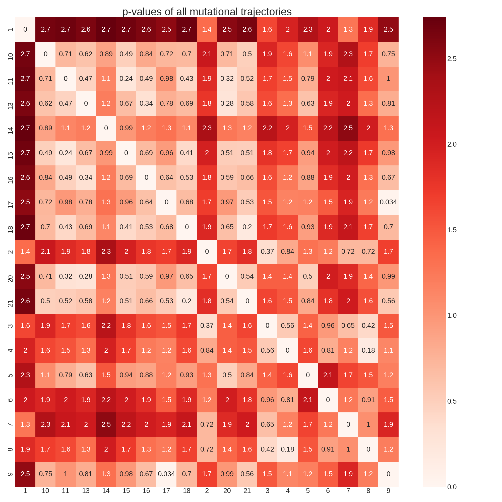

 

# Overview
## What is a muller diagram?
Muller diagrams excel at visualizing evolutionary dynamics of a population over time. A common use case, and the intended use case during development, describes the abundance and succession of genotypes within a population derived from sequencing data from samples at specified timepoints. This provides a useful method of quickly discerning the evolutionary relationship between genotypes seen in a population and how this changes over time.


## Some Basic Concepts

- trajectory/mutational trajectory: A set of frequency measurements of a specific mutation at each sampled time point over the course of an evolution experiment.

- genotype: A group of trajectories which follow a common path.

- clustering: The process of grouping trajectories together to form a genotype. There are two basic types of clustering. Agglomerative clustering describes the case where trajectories or small clusters are grouped together to form a larger cluster. Divisive clustering occurs when an existing cluster is split up into smaller clusters. These scripts use both types of clustering.

- uncertainty: A parameter provided by the user which indicates the uncertainty in the frequency measurements. The default value of 0.03 was chosen based on the performance of Breseq.

- background: When a mutation arises in a population, it is said to be in the background of the mutations that appeared in the same population prior to its detection. A core purpose of these scripts is to describe how any given mutation is related to those that arose before its detection (i.e. its background).

- genotype fixing/sweeping: When a genotype fixes, it removes all pre-existing variation other than itself. All subsequent mutations arise in the background of this genotype.

# Preparing the Data
[Breseq](http://barricklab.org/twiki/bin/view/Lab/ToolsBacterialGenomeResequencing) is a variant caller used to analyze samples genomes during microbial evolution experiments. An evolution experiment which sequences a population at selected timepoints will end up with a number of output tables reporting detected mutations and frequency of each mutation at each timepoint. Each table will look similar to this:


| evidence | position | mutation | freq  | annotation         | gene          | description                      |
|----------|----------|----------|-------|--------------------|---------------|----------------------------------|
| RA       | 14,350   | (A)9>8   | 1.30% | intergenic(48/298) | pepX_1</>dnaE | DNA polymerase III subunit alpha |
| RA       | 14,350   | (A)9>10  | 0.90% | intergenic(48/298) | pepX_1</>dnaE | DNA polymerase III subunit alpha |
| RA       | 19,123   | G>A      | 1.10% | E76K(GAA>AAA)      | pyk           | Pyruvate kinase                  |
| RA       | 23,912   | (A)8>9   | 1.00% | coding(243/312nt)  | PROKKA_00020  | hypothetical protein             |


To prepare the data for use by the muller scripts, add a new column to each table indicating the timepoint it represents, then combine all of the tables into a single table. The result should look something like this:

| timepoint | evidence | position | mutation | freq  | annotation         | gene          | description                      |
|-----------|----------|----------|----------|-------|--------------------|---------------|----------------------------------|
| 10        | RA       | 14,350   | (A)9>8   | 1.30% | intergenic(48/298) | pepX_1</>dnaE | DNA polymerase III subunit alpha |
| 10        | RA       | 14,350   | (A)9>10  | 0.90% | intergenic(48/298) | pepX_1</>dnaE | DNA polymerase III subunit alpha |
| 10        | RA       | 19,123   | G>A      | 1.10% | E76K(GAA>AAA)      | pyk           | Pyruvate kinase                  |
| 3         | RA       | 22,606   | C>A      | 1.50% | Q148K(CAG>AAG)     | PROKKA_00018  | hypothetical protein             |
| 9         | RA       | 23,912   | (A)8>9   | 2.50% | coding(243/312nt)  | PROKKA_00020  | hypothetical protein             |
| 10        | RA       | 23,912   | (A)8>9   | 1.00% | coding(243/312nt)  | PROKKA_00020  | hypothetical protein             |
| 6         | RA       | 26,051   | C>A      | 1.80% | S166I(AGT>ATT)     | PROKKA_00023< | putative permease                |
| 2         | RA       | 26,291   | (T)7>6   | 1.60% | coding(257/906nt)  | PROKKA_00023< | putative permease                |
| 2         | RA       | 35,252   | T>A      | 1.00% | E26V(GAA>GTA)      | PROKKA_00033< | Integrase core domain protein    |


Then, the data should be converted into a table such that each row represents a single mutation, and each timepoint occupies a unique column. An additional column, `Trajectory`, should then be added with a unique identifier for each mutation. The specific format of this identifier is arbitrary, and it may be convienient to simply number the mutations. It does not matter whether additional columns are included in the table (although they may be used to add for annotations later), as long as there is a `Trajectory` column with the unique identifiers for each mutation along with numeric columns for each sampled timepoint.

| Trajectory | position | mutation | gene                       | annotation          | description                                                        | 0    | 1    | 2    | 3    | 4    | 5    | 6    | 7    | 8    | 9    | 10   |
|------------|----------|----------|----------------------------|---------------------|--------------------------------------------------------------------|------|------|------|------|------|------|------|------|------|------|------|
| 1          | 36,414   | G>A      | speA                       | C127Y(TGT>TAT)      | Arginine decarboxylase                                             | 0.00 | 0.06 | 0.10 | 0.17 | 0.00 | 0.00 | 0.00 | 0.00 | 0.00 | 0.00 | 0.00 |
| 2          | 138,043  | C>T      | rlmCD_1                    | H441H(CAC>CAT)      | 23S rRNA (uracilC(5))methyltransferase RlmCD                       | 0.00 | 0.00 | 0.00 | 0.00 | 0.00 | 0.00 | 0.00 | 0.00 | 0.02 | 0.05 | 0.02 |
| 3          | 165,470  | C>A      | PROKKA_00173/>PROKKA_00174 | intergenic(+174/91) | Relaxase/Mobilisation nuclease domain protein/hypothetical protein | 0.09 | 0.11 | 0.16 | 0.00 | 0.00 | 0.00 | 0.00 | 0.00 | 0.00 | 0.00 | 0.00 |
| 4          | 234,888  | C>A      | gapN                       | A95E(GCA>GAA)       |Some definitions NADPdependent glyceraldehyde3phosphate dehydrogenase               | 0.00 | 0.00 | 0.00 | 0.00 | 0.00 | 0.25 | 0.39 | 0.22 | 0.40 | 0.14 | 0.03 |
| 5          | 264,552  | T>C      | rbgA                       | D241D(GAT>GAC)      | Ribosome biogenesis GTPase A                                       | 0.00 | 0.00 | 0.00 | 0.00 | 0.00 | 0.00 | 0.03 | 0.09 | 0.04 | 0.02 | 0.00 |
| 6          | 407,633  | G>T      | gdhA                       | L206F(TTG>TTT)      | NADPspecific glutamate dehydrogenase                               | 0.00 | 0.00 | 0.00 | 0.00 | 0.00 | 0.00 | 0.00 | 0.08 | 0.02 | 0.24 | 0.31 |
| 7          | 458,680  | A>C      | rlmI<                      | L58V(TTG>GTG)       | Ribosomal RNA large subunit methyltransferase I                    | 0.00 | 0.00 | 0.00 | 0.00 | 0.00 | 0.00 | 0.00 | 0.00 | 0.08 | 0.09 | 0.07 |
| 8          | 636,386  | G>A      | lpd_2                      | R34H(CGT>CAT)       | Dihydrolipoyl dehydrogenase                                        | 0.00 | 0.00 | 0.00 | 0.00 | 0.15 | 0.38 | 0.34 | 0.29 | 0.33 | 0.15 | 0.03 |
| 9          | 693,913  | C>A      | PROKKA_00705<              | A116S(GCC>TCC)      | putative ABC transporter ATPbinding protein/MT1014                 | 0.00 | 0.00 | 0.00 | 0.00 | 0.00 | 0.00 | 0.00 | 0.00 | 0.06 | 0.06 | 0.11 |
| 10         | 701,443  | T>G      | ileS<                      | K107T(AAG>ACG)      | IsoleucinetRNA ligase                                              | 0.00 | 0.00 | 0.00 | 0.00 | 0.00 | 0.00 | 0.00 | 0.00 | 0.06 | 0.07 | 0.04 |
| 11         | 764,481  | G>A      | bglF_1<                    | I192I(ATC>ATT)      | PTS system betaglucosidespecific EIIBCA component                  | 0.00 | 0.00 | 0.00 | 0.00 | 0.00 | 0.00 | 0.02 | 0.02 | 0.04 | 0.05 | 0.03 |
| 12         | 860,048  | C>A      | arnB<                      | R288L(CGC>CTC)      | UDP4amino4deoxyLarabinoseoxoglutarate aminotransferase             | 0.00 | 0.00 | 0.00 | 0.00 | 0.00 | 0.00 | 0.00 | 0.05 | 0.10 | 0.15 | 0.14 |
| 13         | 890,427  | G>C      | fhuC                       | G217A(GGA>GCA)      | Iron(3+)hydroxamate import ATPbinding protein FhuC                 | 0.00 | 0.00 | 0.00 | 0.00 | 0.00 | 0.00 | 0.00 | 0.00 | 0.24 | 0.12 | 0.03 |
| 14         | 955,123  | C>A      | PROKKA_00981<              | G119C(GGC>TGC)      | putative HTHtype transcriptional regulator                         | 0.00 | 0.00 | 0.05 | 0.20 | 0.26 | 0.10 | 0.26 | 0.60 | 0.66 | 0.88 | 0.97 |

Note that the frequency of each mutation can be reported as either a percentage out of 100 (ex. 79.42%) or as a number betweeThe two-step method was originally devised by Katya Kosheleva in 2012 to model the evolution of yeast populations, and has since been modified to accomodate a wider array of experimental designs. Since each frequency measurement is analagous to the probability of a mutation being detected at a given timepoint, we can use the binomial distribution to test whether two sets of frequency measurements represent the same underlying series. There are a few key assumptions that must be made:n 0 and 1 (ex. 0.7942). Regardless of which format is contained in the input table, the scripts will convert the frequency values so they fit in the range $[0,1]$.
# Clustering Mutational Trajectories
Two methods have been implemented for clustering trajectories into genotypes, referred to here as the "two-step" method and the hierarchical method.

## Two-step Method
The two-step method was originally devised by Katya Kosheleva in 2012 to model the evolution of yeast populations, and has since been modified to accomodate a wider array of experimental designs. Since each frequency measurement is analagous to the probability of a mutation being detected at a given timepoint, we can use the binomial distribution to test whether two sets of frequency measurements represent the same underlying series. There are a few key assumptions that must be made:

1. The separation between two mutational trajectories that belong to the same genotype is due to measurement error and the error is normally distributed.

2. Each sampled timepoint over the course of an evolutionary experiment is perfectly representative of the population as a whole. That is, mutations that first appear at large frequencies (i.e. 60%) must have appeared and risen to that level since the most resently sampled timepoint (i.e. it was not simply missed during the sampling step).

3. Any two mutational trajectories will have at least one common timepoint where both are detected and not fixed.

Assumption 3 is particularly troublesum, since there are typically a few mutational trajectories which do not satisfy this assumption, and these cases must be handled differently (described after the calculation method).

The two-step method also requires the user to specify a couple arbitrary variables:
- `similarity_cutoff`: defaults to 0.05. Used during the agglomerative clustering step to group trajectories into initial genotypes.
- `link_cutoff`: defaults to 0.25. Used during the unlinking step to determine if a genotype contains at least one pair of mutational trajectories that do not belong to the same genotype.


The two-step method essentially tests whther the average distance between two series is statistically significant given the uncertainty in the data. If the difference is not statistically significant, the two genotypes are grouped into the same genotype. This is done for all possible pairs of mutational trajectories in the dataset.

### Agglomerative clustering based on similarity

The two-step method defines each mutational frequency as the probability of a mutation being detected given $n$ independent measurements. This is best characterized by the binomial distribution which models the probability of a "success" (in this case, the presence of a specific mutation) given the probability of success (the measured frequency).

### Similarity Calculation

If there are two series $X$ and $Y$ that represent a pair of mutational trajectories with $n$ timepoints such that $X=\{X_0,X_1,...,X_n\}$ and $Y=\{Y_0,Y_1,...,Y_n\}$ where $f_{detected} \lt X_i,Y_i \lt f_{fixed}$, there exists a series $\mu$ representing the mean probability of success (a mutation is present) at any time point $i$ such that $\mu=\{\mu_0,\mu_1,...,\mu_n\}$, where $\mu_i=\frac{X_i+Y_i}{2}$ for $0\le i \le n$.

Since $\mu$ represents the average probability of success between the two series at each timepoint and the variance of a binomial distribution as a whole is defined as $\sigma^2=np(1-p)$, the variance $\sigma_i^2$ for each element $\mu_i \in \mu$ is $\sigma_i^2=\mu_i(1-\mu_i)$ for an individual element $\mu_i$.

The variance of the series as a whole is then
$$
\sigma^2 = \frac{1}{n^2}\sum_{i=0}^n \sigma_i^2=\frac{1}{n^2}\sum_{i=0}^n \mu_i(1-\mu_i),
\mu_i=\frac{X_i+Y_i}{2}
$$

Since we are interested in whether the difference between the two series $X$ and $Y$ is statistically significant, we define the difference series $d$ such that $d={d_0,d_1,...,d_n}$ and $d_i=|X_i-Y_i|$. We can then check whether the mean difference in probabilities $\bar{d}$ is
statistically significant using the error function.

The error function has the following interpretation: for a normally-distributed random variable $X \ge 0$, $erf(x)$ gives the probability of $X$ falling in the range $[-x,x]$.

The error function is related to the cumulative distribution function of the normal distribution (denoted as $\Phi$) by
$$
F(x|\mu,\sigma) = \Phi\bigg(\frac{x-\mu}{\sigma}\bigg)= \frac{1}{2}\bigg[1 + erf \bigg(\frac{x-\mu}{\sqrt{2\sigma^2}}\bigg)\bigg]
$$

We want to determine whether the average difference $\bar{d}$ between the two mutational trajectories exceeds the amount expected given the uncertainty in our data:
$$
P(\bar{d} > x) = 1-F(\bar{d}|\mu, \sigma) = \frac{1}{2} - \frac{1}{2}erf \bigg(\frac{\bar{d}}{\sqrt{2\sigma^2}}\bigg)
$$
$$
P(-x<\bar{d}<x) = 1 - erf \bigg(\frac{\bar{d}}{\sqrt{2\sigma^2}}\bigg)
$$

However, as noted above, this test is only performed for the measurements in $X$ and $Y$ which satisfy the requirement $f_{detected} < f <f_{fixed}$ for $f \in X,Y$. timepoints where neither series satisfy this requirement are discarded. If there is no overlap between the timepoints in $X$ and $Y$ after these timepoints have been discarded then the above probability calculation cannot be done. This does not mean that both series are unrelated; if both timepoints fix immediately (at the timepoint they are first detected) during the same timepoint, they should be added to the same genotype. There is an additional test to address this edge case. If two trajectories are fixed at 3 or more common timepoints they are assigned to the same genotype.

### Summary

$$
\mu=\frac{1}{2}(X_i+Y_i)
$$

$$
\sigma = \mu(1-\mu)
$$
$$
d=|X_i-Y_i|
$$

### Example
Given two mutational series from the same genotype:
| Trajectory    | 0 | 1    | 2   | 3    | 4    | 5   |
|---------------|---|------|-----|------|------|-----|
| trajectory-A1 | 0 | 0    | 0   | 0.1  | 0.5  | 0.5 |
| trajectory-A2 | 0 | 0    | 0   | 0.06 | 0.35 | 0.4 |
Calculate the series for $\mu$, $\sigma^2$, and $d$:


|            | 0 | 1 | 2 | 3      | 4        | 5      |
|------------|---|---|---|--------|----------|--------|
| $\mu_i$         | 0 | 0 | 0 | 0.08   | 0.425    | 0.45   |
| $\sigma_i^2$      | 0 | 0 | 0 | 0.221 | 0.733 | 0.743 |
| $d_i$           | 0 | 0 | 0 | 0.04   | 0.15     | 0.1    |

This gives us the following values:

$\sigma^2=(0.074+0.244+0.248)/9=0.062$

$\bar{d}=(0.040+0.150+0.100)/3=0.097$

$$
p = 1 - erf \bigg(\frac{\bar{d}}{\sqrt{2\sigma^2}}\bigg)=
1-erf \bigg(\frac{0.097}{\sqrt{2 \times 0.0.062}}\bigg)=
1-erf(0.091)=1-0.300=0.700
$$

Note that while these values were rounded to three decimal places for brevity, the actual calculation used the full numbers.

### Summary

The similarity calculation uses three sets of values:
$$
  \mu = {\frac{1}{2}(X_i + Y_i)}
$$
$$
  \sigma = \mu_i(1-\mu_i)
$$
$$
  d = |X_i-Y_i|
$$

### Example
Given two mutational series from different genotypes:
| Trajectory    | 0 | 1    | 2   | 3    | 4    | 5   |
|---------------|---|------|-----|------|------|-----|
| trajectory-A1 | 0 | 0    | 0   | 0.1  | 0.5  | 0.5 |
| trajectory-B1 | 0 | 0.07 | 0.1 | 0.02 | 0.01 | 0   |
Calculate the series for $\mu$, $\sigma^2$, and $d$:
|            | 0 | 1        | 2      | 3      | 4        | 5      |
|------------|---|----------|--------|--------|----------|--------|
| mu         | 0 | 0.035    | 0.05   | 0.06   | 0.255    | 0.25   |
| sigma      | 0 | 0.033775 | 0.0475 | 0.0564 | 0.189975 | 0.1875 |
| d          | 0 | 0.07     | 0.1    | 0.08   | 0.49     | 0.5    |

This gives us the following values:

$\sigma^2=(0.034+0.048+0.056+0.190+0.189)/16=0.020606$

$\bar{d}=(0.07+0.1+0.08+0.49+0.5)/5=0.248$

$$
p = 1 - erf \bigg(\frac{\bar{d}}{\sqrt{2\sigma^2}}\bigg)=
1-erf \bigg(\frac{0.248}{\sqrt{2 \times 0.021}}\bigg)=
1-erf(1.223)=1-0.916=0.084
$$


### Unlinking based on maximal distance

An important note about the above clustering method is that a pair of mutations is added to a genotype if the similarity of only one of the trajectories A in a given pair of trajectories A and B is sufficiently similar to the root trajectory G that forms the genotype. While trajectory B may be sufficiently similar to trajectory A, and trajectory A is sufficiently similar to trajectory G, trajectory B may not be similar enough to trajectory G to warrant its inclusion into the genotype. Due to this, each genotype must be split into child genotypes each of which *is* sufficiently similar.

For each genotype with at least one pair of trajectories that have a p-value less than `link_cutoff` (defined above), the two trajectories with the least similarity between them (as determined by the above test of probability) are extracted and form two new genotypes. All remaining trajectories in the original genotype are then sorted into one of these new genotypes based on which of the root trajectories of each genotype is most similar. This process continues until no new genotypes are created.

#### Example

For the three mutational trajectories in the above examples, the pairwise p-values are:

| $p$| A2 | B1 |
|--|----|----|
|A1|0.700|0.084|
|A2|   |0.177|

The two genotypes with the least similarity are A1 and B1. Since at least one pair of trajectories in this genotype have a p-value less than the default `link_cutoff` value of 0.25, these two trajectories are split into their own genotypes, and the remaining trajectories (in this case, A2) are sorted into the genotype that is most similar. The resulting genotypes are then:

Genotype A:
- trajectory A1
- trajectory A2

Genotype B:
- trajectory B1

## Hierarchical Method
The second clustering method implemented relied on hierarchical clustering based on a specified distance metric (a measurement of the similarity of two series). It was implemented in an attempt to address the assumptions made by the two step method.

Hierarchical clustering attempts to group elements together based on a measure of similarity. Each mutational trajectory is first assigned to its own cluster, then clusters are progressively combined based on a specified similarity metric until the maximum distance between any two points in a cluster exceeds a given breakpoint. Hierarchical clustering does not require a pre-defined number of clusters (compared to k-means clustering) which is advantageous since the resulting number of genotypes is unknown.

### Distance metrics
There are currently 3 distance metrics implemented in the scripts: binomial distance (described above), pearson's distance, and minkowski's distance. Each is designed to measure the similarity of two series but do so by measuring different features.


#### Pearson's distance
Pearson's distance (based on Pearson's correlation coefficient) measures the similarity of two series based on how well they correlate. It essentially checks whether a proportional increase seen in one series is also seen in the other. It is best used when there are a large number of measurements available in both series, but can be adjusted (see below) to work with small datasets.

Pearson's correlation coefficient is a measure of the linear correlation between two series.
It has a value between -1 and 1 which can be interpreted as such:
  1. A value of 1 indicates perfect correlation between two series
  2. A value of 0 indicates there is no correlation between two series
  3. A value of -1 indicates perfect negative correlation between two series.

Pearsons's correlation coefficient can be calculated as

$$
r(X,Y) = \frac{cov(X,Y)}{\sigma_X \sigma_Y} =
\frac{\sum_{i=0}^n (X_i-\bar{X})(Y_i-\bar{Y})}{\sigma_X \sigma_Y}
$$

Since distance values between two series cannot be negative, Pearsons's distance metric is simply $1-r(X,Y)$. Unfortunately, since the number of sampled timepoints in a typical evolutionary experiment is relatively low, the sample coefficient derived from $r(X,Y) is not an unbiased estimate for the population coefficient. After adjusting for this, the resulting estimate of the pearson correlation coefficient for the sample set is

$$
r_{adjusted}(X,Y) = \sqrt{1-\frac{(1-r^2)(n-1)}{n-2}}
$$

which approches the population coefficient for large values of $n$.


#### Minkowski distance
The minkowski distance measures the similarity of any two series based on the distance between the two trajectories at every sampled timepoint.

The generalized minkowski distance between two series $X$ and $Y$ is defined as
$$
d_m=\bigg[\sum_{i=0}^n|X_i-Y_i|^p\bigg]^\frac{1}{p}, p \ge 1
$$

where $p=2$ (equivilent to the euclidean distance) for these scripts.

### Clustering

Once the distance between all possible pairs of mutational trajectories has been calculated, each trajectory can be grouped with other trajectories that are sufficiently similar. Trajectories are first assigned to their own cluster, then clusters are merged with similar clusters until the mean distance between trajectories in the cluster exceeds a specified breakpoint.

## Comparison of Clustering Methods

The scripts currently use the two-step method by default, but this will be replaced by the hierarchical method after more testing is done.
The hierarchical method and the desired distance metric can be selected using the `--method` and `--metric` options, respectively.

### Two-Step clustering vs hierarchical clustering

For the B1 testing population, the two-step method produces the following clusters:



Each line is a single trajectory and is grouped with those of the same color. A major weakness of the two-step clustering method is its inability to accurately extract genotypes during timepoints when a large number of mutational trajectories are detected at similar frequencies. An example of this has been highlighted in the image above, where there are ten trajectories split among three genotypes.

Let's use the tan genotype (consisting of 6 trajectories) as an example. The trajectories labelled A, B, and C appear to be more correlated to each other than to the other three trajectories that have been grouped into this genotype. While the two-step method determined that there was insufficient evidence to group the trajectories into a separate genotype, a human observer may disagree.

Combining the dinomial distance metric with hierarchical clustering provides the following plot:


This method splits the previous genotype up and groups A and B together (blue), while C (yellow) is paired with another trajectory which was not part of the original genotype, but shares a similar path as C.


# Nesting successive genotypes

## Checks
After grouping mutational trajectories into genotypes, the scripts then attempt which genotypes arise in the background of which other genotypes.
Genotypes are nested according to a few basic rules:
### Summation
Check whether the unnested and nested genotype consistently sum to greater than 1. This is weak evidence that one of the genotypes is a background and the other arises in the background of the first. The implementation currently checks whether the sum of both trajectories is greater than 1.15 (chosen based on the original implementation) at least once, or greater than 1.03 (based on the user-specified uncertainty option) at least twice. Future versions of the script will implement this consistency check in a more statistically-relevant way.

### Size
This checks Whether one of the genotypes is consistently larger than the other. A genotype is considered consistently greater than another if the difference between the two frequencies exceeds a value of 0.15 (based on original scripts) at least once or exceeds 0.03 (based on the uncertainty option) at least twice. Future versions of the script will define this in a more statistically-relevant manner.

### Correlation
The covariance between two series of random variables provides a measure of the correlation between both series. This is also used to calculate the pearson distance metric. A genotype which arises in the background of another genotype must be correlated with the parent genotype.
The covariance of two series $X$ and $Y$ is defined as
$$
Cov(X,Y) = \frac{1}{n}\sum_{i=0}^n (X_i-\bar{X})(Y_i-\bar{Y})
$$

### The Jaccard Distance

The jaccard distance is a measurement of the dissimilarity of two sample sets. Since each frequency measurement describes the abundance of a mutation at a sampled timepoint, we can use the jaccard distance to compare the abundance of two genotypes over the course of an experiment.
Since each genotype represents a set of abundance measurements, the jaccard distance between two genotypes $X$ and $Y$ can be calculated as follows:
$$
J(X,Y)=1 - \frac{|X\cup Y|}{|X|+|Y|+|X \cap Y|}\equiv \frac{|X\cup Y|-|X \cap Y|}{|X \cup Y|}
$$
Since each genotype is a set of frequency measurements, the cardinality of each set can be computed as
$$
|X| = \sum_{i=0}^n X_i
$$


Based on this, the union and intersection can be defined as
$$
|X \cap Y| = \sum_{i=0}^n min(X_i,Y_i)
$$
$$
|X \cup Y| = |X| + |Y| - |X \cap Y|
$$


When $Y$ arises in $X$, all elements of $Y$ are also contained in $X$, $|X \cup Y| = |X|$ and $|X \cap Y| = |Y|$, reducing the above equation to
$$
J(X,Y) = \frac{|X|-|Y|}{|X|}
$$


If the computed jaccard distance is equal to the above equation, genotype $Y$ arises in genotype $X$.

#### Example

| Genotype   | 0 | 17 | 25 | 44    | 66    | 75    | 90    |
|------------|---|----|----|-------|-------|-------|-------|
| genotype-6 | 0 | 0  | 0  | 0.273 | 0.781 | 1     | 1     |
| genotype-7 | 0 | 0  | 0  | 0.403 | 0.489 | 0.057 | 0.08  |
| genotype-3 | 0 | 0  | 0  | 0     | 0.211 | 0.811 | 0.813 |

The jaccard distance between genotype-6 and genotype-7, assuming genotype-6 is the background:
$$|X| = 0.273+0.781+1+1 = 3.054$$
$$|Y| = 0.403+0.489+0.057+0.08=1.029$$
$$|X \cap Y|=.273+.489+.057+0.08=0.899$$
$$|X \cup Y| \equiv |X|+|Y|-|X \cap Y|= 3.054+1.029-0.899=3.184$$
Now let's calculate the jaccard distance the traditional way:
$$
J(X,Y)=\frac{|X\cup Y|-|X \cap Y|}{|X \cup Y|}=\frac{3.184-0.899}{3.184}=0.718
$$
Test against the ideal distance:
$$
J(X,Y) = \frac{|X|-|Y|}{|X|}=\frac{3.054-1.029}{3.054}=0.663
$$

Since $0.718\ne 0.663$, We cannot say that $Y$ arises in the background of $X$.

Let's test if genotype-3 arises in the background of genotype-6:

$$|X| = 0.273+0.781+1+1 = 3.054$$
$$|Y| = 0.211+0.811+0.813=1.835$$
$$|X \cap Y|=0+.211+.811+.813=1.835$$
$$|X \cup Y| \equiv |X|+|Y|-|X \cap Y|= 3.054+1.835-1.835=3.184$$

The jaccard distance is then
$$
J(X,Y)=\frac{|X\cup Y|-|X \cap Y|}{|X \cup Y|}=\frac{3.184-1.835}{3.184}=0.425
$$
Test against the ideal distance:
$$
J(X,Y) = \frac{|X|-|Y|}{|X|}=\frac{3.054-1.835}{3.054}=0.425
$$

So, there is evidence that genotype-3 arises in the background of genotype-6.


## Ruleset

Given the above checks, this is the ruleset for determining if a nested genotype is a potential background for the unnested genotype being tested.

1. If the genotypes are begatively correlated, the nested genotype is not a background candidate for the current genotype.
2. If the unnested genotype contains more elements than the nested genotype, it cannot be a background candidate.
3. If the nested genotype is consistently larger than the unnested genotype, is positively correlated with the unnested genotype, and the jaccard distance indicates the unnested genotype is a subset of the nested genotype, then the nested genotype is assigned as the background for the unnested genotype. The newly nested genotype is then available as a potential background candidate for subsequent unnested genotypes.
4. If the unnested genotype is consistently smaller than the nested genotype or is determined to be a subset of the nested genotype, the nested genotype is considered a potential background for the unnested genotype. The unnested genotype will continue to be tested against all other nested genotypes. If no other genotype has greater evidence for being the background of the unnested genotype, the script prioritises the nested genotype with the greatest maximum frequency which was detected closest to when the unnested genotype was first detected.


# Genotype Filters
Some of the detected trajectories or genotypes do not represent real mutations, and need to be removed from the analysis. Since all pre-existing variation is removed when a specific genotype sweeps and fixes, any mutation that is seen before, during, and after the timepoint where the sweep occured are likely due to measurement error.

Common situations where a trajectory or genotype should be removed:

1. A mutation appears before and after a genotype sweeps and removes all pre-existing variation. Since the mutation should have been removed when the genotype fixed
2. A mutation fixes immediately during the same timepoint it is detected (there are no intermediate values), then becomes undetected again.

An exception has been made for the case where a mutation appears both before and after a genotype sweeps, but is undetected at the timepoint where this occurs. This represents a mutation arising, being removed during a genotype sweep, then arising again.

Note that when a genotype is removed, all of the trajectories that comprise that genotype are removed and the clustering algorithm is re-run on the remaining dataset.

# Usage

## Options

### Genotype colors

It is possible to explicitly choose the color of individual genotypes using the `--genotype-colors` option. The value passed to this option should be a valid path to a text-delimited file composed of two columns. The first column is the genome name, the second column is the assigned color of that genotype as a hex color code (ex. #34FA19). There are two reserved genotype names: `genotype-0` to represent the root background, and `removed` which represents the trajectories that were filtered out of the analysis.

For example:
```
genotype-1  #4501F3
genotype-22 #FF00FF
genotype-8  #678341
removed #FF0000
```

# Output
All files are prefixed by the name of the original input table.

## Tables
### Genotype and Trajectory tables
- .muller_genotypes.tsv
- .muller.trajectories.tsv
- tables/.muller_genotypes.original.tsv
- tables/.trajectories.original.tsv

Tables listing the genotypes and trajectories encountered in the analysis. The trajectory tables also link each trajectory to its respective genotype. There are two versions of these tables: one set with the original input trajectories and the initial calculated genotypes and another set with the final trajectories and genotypes left in the analysis after the filtering step. The trajectory tables include all columns from the input trajectory table as well as the timeseries and annotation columns used in the analysis.

Example Genotype Table:
| Genotype    | 0.000 | 17.000 | 25.000 | 44.000 | 66.000 | 75.000 | 90.000 |
| ----------- | ----- | ------ | ------ | ------ | ------ | ------ | ------ |
| genotype-1  | 0.000 | 0.380  | 0.432  | 0.000  | 0.000  | 0.000  | 0.000  |
| genotype-2  | 0.000 | 0.000  | 0.000  | 0.403  | 0.489  | 0.057  | 0.080  |
| genotype-3  | 0.000 | 0.000  | 0.000  | 0.000  | 0.000  | 1.000  | 1.000  |
| genotype-4  | 0.000 | 0.000  | 0.261  | 1.000  | 1.000  | 1.000  | 1.000  |
| genotype-5  | 0.000 | 0.000  | 0.000  | 0.273  | 0.781  | 1.000  | 1.000  |
| genotype-6  | 0.000 | 0.000  | 0.092  | 0.052  | 0.031  | 0.000  | 0.052  |
| genotype-7  | 0.000 | 0.000  | 0.000  | 0.000  | 0.278  | 0.822  | 0.803  |
| genotype-8  | 0.000 | 0.000  | 0.000  | 0.336  | 0.452  | 0.918  | 0.899  |
| genotype-9  | 0.000 | 0.000  | 0.000  | 0.076  | 0.043  | 0.219  | 0.255  |
| genotype-10 | 0.000 | 0.021  | 0.000  | 0.086  | 0.182  | 0.095  | 0.058  |


### Tables for ggmuller
- tables/.ggmuller.populations.tsv
- tables/.ggmuller.edges.tsv

These tables are designed for use with the ggmuller r package. The `populations` table describes the population/abundance of each genotype at each timepoint while the `edges` table describes the ancestry relationship between genotypes.

### Linkage matrix
- tables/.linkagematrix.tsv

This table is generated using the [scipy](https://docs.scipy.org/doc/scipy/reference/cluster.hierarchy.html) python package. It describes the agglomeration of clusters starting with the individual trajectories, as well as the mean, variance, and trajectory count of each cluster.
Columns:
- `left`, `right`: The two sub-clusters merged to create the current clusters
- `clusterId`: The id assigned to this cluster. Note that since the individual genotypes are not included in the table, the clusters are numbered in order starting with 1 + the total number of genotypes.
- `distance`: The distance between the two sub-clusters.
- `observations`: The number of mutational trajectories contained in this cluster.


Example linkage matrix:
| left | right | distance | observations | resultingCluster |
|------|-------|----------|--------------|------------------|
| 7    | 18    | 0.034    | 2            | 19               |
| 13   | 17    | 0.175    | 2            | 20               |
| 8    | 11    | 0.199    | 2            | 21               |
| 2    | 5     | 0.239    | 2            | 22               |
| 10   | 3     | 0.279    | 2            | 23               |
| 9    | 12    | 0.370    | 2            | 24               |
| 23   | 6     | 0.529    | 3            | 25               |
| 22   | 21    | 0.624    | 4            | 26               |
| 26   | 1     | 0.708    | 5            | 27               |
| 24   | 16    | 0.760    | 3            | 28               |
| 14   | 25    | 0.786    | 4            | 29               |
| 15   | 20    | 0.988    | 3            | 30               |
| 29   | 27    | 1.094    | 9            | 31               |
| 31   | 19    | 1.358    | 11           | 32               |
| 30   | 28    | 1.362    | 6            | 33               |
| 4    | 32    | 1.499    | 12           | 34               |
| 33   | 0     | 2.125    | 7            | 35               |
| 34   | 35    | 4.943    | 19           | 36               |

### Distance Matrix
- tables/.distance.tsv

A table of pairwise distance values between each trajectory.

### Muller table
- tables/.muller.tsv

The converted form of the `.ggmuller.populations.tsv` and `.ggmuller.edges.tsv` used to generate the muller plots. This file is created from the r script, described later.

## Graphics
Each of the output plots use the same palette for genotypes and trajectories. A genotype colored a shade of blue will share that color across all graphs and diagrams which depict that genotype. There are two palettes: one to indicate each clade in the geneology and one to easily distinguish between different genotypes. Each graphic is created with both palettes, and some are provided in multiple formats for convienience.

### Muller Plots
- .muller.annotated.png
- graphics/clade/.muller.annotated.svg
- graphics/clade/.muller.annotated.png
- graphics/clade/.muller.unannotated.png
- graphics/distinctive/.muller.annotated.distinctive.png
- graphics/distinctive/.muller.annotated.distinctive.svg

The main value of a muller plot is to quickly visualize abundance and geneology of genotypes over the course of an evolution experiment.



### Geneology Plots
- .geneology.png
- graphics/.geneology.distinctive.png

These are simple flowcharts indicating the relationship between genotypes and clades. The original genotype of each clade are shown to arise in "genotype-0", the root background. The ancestry of all other genotypes are then shown relative to these clades.



### Trajectory and genotype plots
- .genotypes.png
- .genotypes.filtered.png
- .trajectories.distinctive.png

Timeseries plots of the frequency of each trajectory and genotype at each timepoint. Trajectories are colored according to which genotype they were grouped into. The `.genotypes.filtered.png` file includes trajectories that were filtered out during the filtering step (clored black).



### Distance Heatmap
- graphics/.heatmap.distance.png

A pairwise comparison of the calculated distance between each mutational trajectory. Trajectories are grouped by the final genotype. The heatmap will be annotated with the distance values if there are fewer than thirty total trajectories in the analysis.



### Dendrogram
- graphics/.dendrogram.png
Shows the arrangment and distance between clusters and member trajectories.


## Scripts
- scripts/example.mermaid.md
- scripts/example.r

Two external scripts are used during the course of this analysis. The r script is based on the [ggmuller](https://cran.r-project.org/web/packages/ggmuller/vignettes/ggmuller.html) package implemented in r, and is used to convert the genotypes data into a format required to generate the muller plots. This script also generates a basic muller plot (/graphics/distinctive/.muller.png), although all other muller plots are created with the python implementation. The [mermaid](https://mermaidjs.github.io) script is used to generate the geneology plots.

## Supplementary files
- supplementary-files/example.json

A json-formatted file with all parameters used in the analysis.


